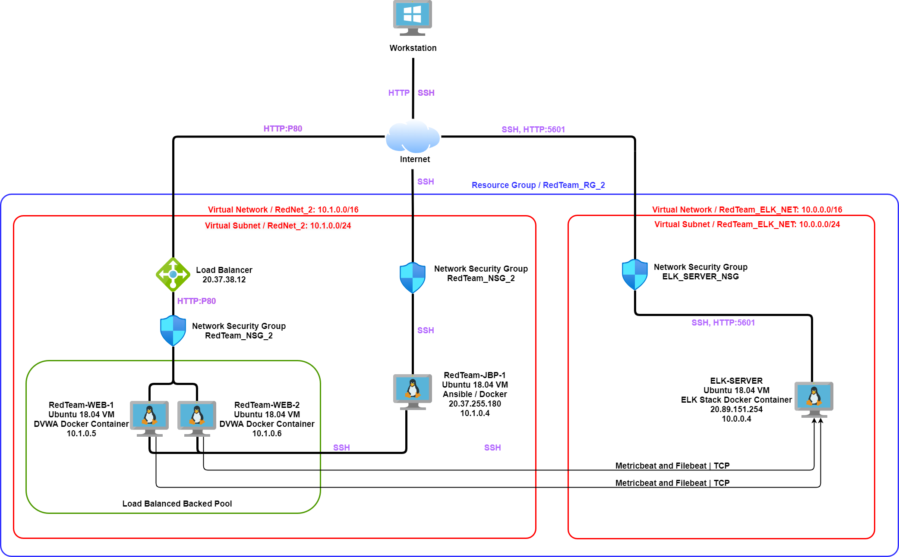

## Automated ELK Stack Deployment

The files in this repository were used to configure the network depicted below.



These files have been tested and used to generate a live ELK deployment on Azure. They can be used to either recreate the entire deployment pictured above. Alternatively, select portions of the YAML file may be used to install only certain pieces of it, such as Filebeat.

  - [ELK Server Install](Scripts/Ansible/ELK/install_elk.yml)
  - [Metricbeat Playbook](Scripts/Ansible/Metricbeat/metricbeat-playbook.yml)
  - [Filebeat Playbook](Scripts/Ansible/Filebeat/filebeat-playbook.yml)

This document contains the following details:
- Description of the Topology
- Access Policies
- ELK Configuration
  - Beats in Use
  - Machines Being Monitored
- How to Use the Ansible Build


### Description of the Topology

The main purpose of this network is to expose a load-balanced and monitored instance of DVWA, the D*mn Vulnerable Web Application.

Load balancing ensures that the application will be highly functional and available, in addition to restricting traffic to the network.

- What aspect of security do load balancers protect?
  
  - A Load balancer adds resiliency to your Network by rerouting live traffic from one server to another server, in other words it distributes traffic evenly across the servers. If a server falls due to a DDoS attack or becomes unavailable otherwise the Load Balancer redirects the traffic.

    
  
- What is the advantage of a jump box?

  - A Jump Box Provisioner adds a layer of protection against attackers as it prevents all Web servers from being exposed to the public via a public IP Address. The advantage of a Jump Box Provisioner is that it allows us monitoring and logging on a single box (VM). We can also restrict the IP addresses able to communicate with the Jump Box.
  
    

Integrating an ELK server allows users to easily monitor the vulnerable VMs for changes to the network and system logs.
- What does Filebeat watch for?
  - Filebeat monitors the log files or locations that you specify, collects log events, and forwards them either to Elasticsearch or Logstash.

    
  
- What does Metricbeat record?
  - Metricbeat takes the metrics and statistics that it collects and ships them to the output that you specify, such as Elasticsearch or Logstash.

The configuration details of each machine may be found below.

| Name          | Function | IP Address | Operating System |
|---------------|----------|------------|------------------|
| RedTeam-JBP-1 | Gateway  | 10.1.0.4 / 20.37.255.180 | Linux (Ubuntu 18.04) |
| RedTeam-WEB-1 | Web-Server | 10.1.0.5 | Linux (Ubuntu 18.04) |
| RedTeam-WEB-2 | Web-Server | 10.1.0.6 | Linux (Ubuntu 18.04) |
| ELK-SERVER | ELK-Server | 10.0.0.4 / 20.89.151.254 | Linux (Ubuntu 18.04) |

#### Access Policies

The machines on the internal network are not exposed to the public Internet. 

Only the Jump Box Provisioner machine can accept connections from the Internet. Access to this machine is only allowed from the following IP addresses:
- Admin`s IP Address

Machines within the network can only be accessed by each other (Port 22 (SSH)).
- Which machine did you allow to access your ELK VM? What was its IP address?
  - Jump-Box-Provisioner IP: 10.1.0.4

A summary of the access policies in place can be found in the table below.

| Name     | Publicly Accessible | Allowed IP Addresses |
|----------|---------------------|----------------------|
| RedTeam-JBP-1 | Yes              | Admin`s IP Address   |
| RedTeam-WEB-1         | No | 10.1.0.4 |
| RedTeam-WEB-2         | No | 10.1.0.4 |
| ELK-SERVER         | No | 10.1.0.4 |

### Elk Configuration

Ansible was used to automate configuration of the ELK machine. No configuration was performed manually, which is advantageous because services running can be limited, system installation and update can be streamlined, and processes become more replicable. 
- What is the main advantage of automating configuration with Ansible?
  - It gives you flexibility and lets you customize your Playbook based on the needs of the server.

The playbook implements the following tasks:
- Install docker.io
````
- name: INSTALL DOCKER.IO
 apt:
   update_cache: yes
   name: docker.io
   state: present
````
- Install python3-pip
````
- name: INSTALL PIP3
  apt:
  force_apt_get: yes
  name: python3-pip
  state: present
````
- Install docker python module
````
- name: INSTALL DOCKER PYTHON MODULE
  pip:
    name: docker
    state: present
````
- Increase System Memory
````
- name: USE MORE MEMORY
  sysctl:
    name: vm.max_map_count
    value: "262144"
    state: present
    reload: yes
````
- Download and launch docker elk stack
````
- name: DOWNLOAD AND LAUNCH ELK CONTAINER
  docker_container:
    name: elk
    image: sebp/elk:761
    state: started
    restart_policy: always
    published_ports:
      - 5601:5601
      - 9200:9200
      - 5044:5044
````


The following screenshot displays the result of running `docker ps` after successfully configuring the ELK instance. See [docker_ps_output](.images/docker_ps_output.png)


### Target Machines & Beats
This ELK server is configured to monitor the following machines:
- RedTeam-WEB-1 | 10.1.0.5
- RedTeam-WEB-2 | 10.1.0.6

We have installed the following Beats on these machines:
- Metricbeat
- Filebeat

These Beats allow us to collect the following information from each machine:

- Filebeat and metricbeat both collect data from the web servers created. Filebeat will log information of the file system, specially which files have been changed and when. Metricbeat collects metrics from the system and the services running on each server.

### Using the Playbook
In order to use the playbook, you will need to have an Ansible control node already configured. Assuming you have such a control node provisioned: 

SSH into the Jump Box Provisioner, start up the Ansible control node and navigate to the `/etc/ansible/ ` directory. In this directory we have our playbooks, hosts file and ansible.cfg file.

Commands to connect to JBP and Ansible are as follow:
- `ssh RBcyber@20.37.255.180`
- `sudo docker ps -a`
- `sudo docker start magical_kirch [ansible container name]`
- `sudo docker attach magical_kirch [ansible container name]`

Previously we added our webservers and elk server to the `hosts` file.
- `cd /etc/ansible/ `
- `sudo nano hosts`
````
[webservers]
10.1.0.5 ansible_python_interpreter=/usr/bin/python3
10.1.0.6 ansible_python_interpreter=/usr/bin/python3
[elkservers]
10.0.0.4 ansible_python_interpreter=/usr/bin/python3
````
`[webservers]` and `[elkservers]` are groups. When we run playbooks with Ansible, we specify which group to run them on. This allows us to run certain playbooks on some machines, but not on others.

We also specified our remote user in the `ansible.cfg` which is the Admin in our case.
- `sudo nano ansible.cfg`

````
default user to use for playbooks if user is not specified
(/usr/bin/ansible will use current user as default)
remote_user = RBcyber2021
````
These changes are crucial for our playbooks since we will specify on what machines the beats will be installed. And who will have access to them.


Next run the Playbooks with following command:
  - `ansible-playbook metricbeat-playbook.yml`  | [Metricbeat Playbook](Scripts/Ansible/Metricbeat/metricbeat-playbook.yml)
  - `ansible-playbook filebeat-playbook.yml`    | [Filebeat Playbook](Scripts/Ansible/Filebeat/filebeat-playbook.yml)  

Check that the ELK Server is running by visiting the Kibana URL http://104.41.167.24:5601/app/kibana#/home
- 104.41.167.24 is the Elk server’s Public IP and 5601 is the Port it connects to.

Notes:

- **Download and Installation in one step!**
````
  - name: DOWNLOAD METRICBEAT AND INSTALL METRICBEAT
    apt: 
      deb: "https://artifacts.elastic.co/downloads/beats/metricbeat/metricbeat-7.14.0-amd64.deb"
      state: present
````

- **Change IP to 10.0.0.4 for setup.kibana and output.elasticsearch (connecting our webVM's to the ELK server), this saves us from downloading the filebeat-config.yml and metricbeat-config.yml to the Ansible Control Node and dropping it into the WEB-Servers**
````
  - name: Update setup.kibana in /etc/metricbeat/metricbeat.yml
    replace:
      path: /etc/metricbeat/metricbeat.yml
      regexp: '(\s+)#host: "localhost:5601"(\s+.*)?$'
      replace: '\1host: "10.0.0.4:5601"\2'
      backup: yes

  - name: Update output.elasticsearch in /etc/metricbeat/metricbeat.yml
    replace:
       path: /etc/metricbeat/metricbeat.yml
      regexp: '(\s+)hosts: \["localhost:9200"\](\s+.*)?$'
      replace: '\1hosts: ["10.0.0.4:9200"]\2'
      backup: yes
````
- **Specify on what Machine to install Metricbeat**
````
  - name: INSTALL METRICBEAT
    hosts: webservers 
    become: true
    tasks:
````
- **Running Playbooks**

  - `ansible-playbook metricbeat-playbook.yml`
  - `ansible-playbook filebeat-playbook.yml`

- **Specify on what Machine to install ELK Server**
````
  - name: CONFIGURE ELK VM WITH DOCKER
    hosts: elkservers
    remote_user: RBcyber2021
    become: true
    tasks:
````
- **Which file is the playbook?**
  - [Metricbeat Playbook](Scripts/Ansible/Metricbeat/metricbeat-playbook.yml)
  - [Filebeat Playbook](Scripts/Ansible/Filebeat/filebeat-playbook.yml) 

