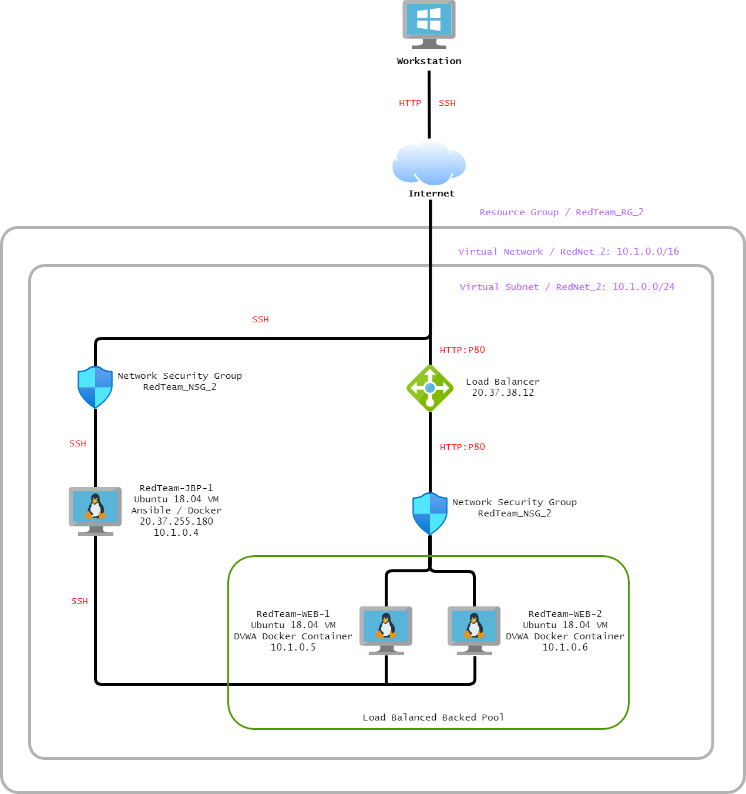

### Week 12 Homework Submission File: Cloud Security Homework

**Objective**

Use a free account at [draw.io](https://app.diagrams.net/) to diagram the entire cloud network you have created.

    - Your diagram should show the following:
        - Azure resource group
        - Virtual network with IP address range
        - Subnet range
        - Flow of specific traffic (e.g., HTTP, SSH)
        - Security group blocking traffic
        - Load balancer
        - All five VMs that you have launched
        - Where Docker and Ansible are deployed
        - Availability Zones

### Solution

