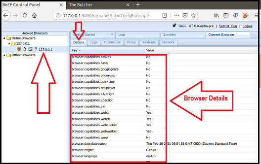
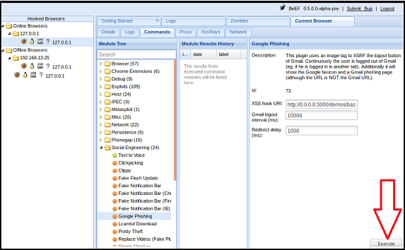

### BeEF (Setup and Demonstration)

1. Complete the following to set up the activity. 

   - On Vagrant, open a command line and run the following command: `sudo beef`

   - When prompted for a password, enter `cybersecurity`.

   - This will kick off the BeEF application and return many details about the application to your terminal.

   - Along with these details are several URLs that can be used to access to BeEF's User Interface (UI). For example: `UI_URL: http://127.0.0.1:3000/ui/panel` 

   - To access the BeEF GUI, right-click the first URL and select Open Link.

     

   - When the BeEF webpage opens, login with the following credentials:

     - Username: `beef`

     - Password: `feeb`

     

   - You have successfully completed the setup when you have reached the `BeEF Control Panel` shown in the image below:

     

2. The Browser Exploitation Framework (BeEF) is a practical client-side attack tool that exploits vulnerabilities of web browsers to assess the security posture of a target.      

   - While BeEF was developed for lawful research and penetration testing, criminal hackers leverage it as an attack tool.

   - An attacker takes a small snippet of code, called a BeEF Hook, and determines a way to add this code into a target website. This is commonly done by cross-site scripting.

   - When subsequent users access the infected website, the users' browsers become *hooked*.
     - Once a browser is hooked, it is referred to as a **zombie**. A zombie is an infected browser that awaits instructions from the BeEF control panel.
     - The BeEF control panel has hundreds of exploits that can be launch against the *hooked* victims, including:
       - Social engineering attacks 
       - Stealing confidential data from the victim's machine
       - Accessing system and network information from the victim's machine

3. BeEF includes a feature to test out a simulation of an infected website.

   - To access this simulated infected website, locate the following sentence on the BeEF control panel: `To begin with, you can point a browser towards the basic demo page here, or the advanced version here.`

   - Click the second "here" to access the advanced version.  

     

   - This will open the following website, which has been infected with a BeEF hook.

     

   - Note that once you have pulled up this infected webpage, your browser has now been hooked!

     - If your browser has not been hooked, restart your browser and try again.

   - Return to the control panel. On the left side, you can notice that your browser has become infected since accessing the infected Butcher website. Note that if multiple browsers become infected they will all be listed individually on the left hand side of this panel.

     - Click on the browser `127.0.0.1` as indicated in the screenshot below.

       

     - Under the Details tab, we can see information about the infected browser. 

4. Now we are ready to test an exploit.

   - Select the Commands tabs. 

     - This will list folders of hundreds of exploits that can be ran against the hooked browser. Note that many may not work, as they are dependent on the browser and security settings enabled.

   - First, we'll attempt a social engineering phishing exploit to create a fake Google login pop up. We can use this to capture user credentials.

   - To access this exploit, select Google Phishing under Social Engineering.

     

   - After selecting this option, the description of the exploit and any dependencies or options are displayed in the panel on the right.

     

   - To launch the exploit, select Execute in the bottom right corner.

     - After selecting Execute, return back to your browser that was displaying the Butcher Shop website. Note that it has been changed to a Google login page.

     - A victim could easily mistake this for a real login prompt.

   - Lets see what would happen if a victim entered in their credentials. Use the following credentials to login in to the fake Google page. 

     - Username: `hackeruser`

     - Password: `hackerpass`

       

   - Return to the BeEF control panel. In the center panel, select the first option. Note that now on the right panel, the username and password have been captured by the attacker.

     
