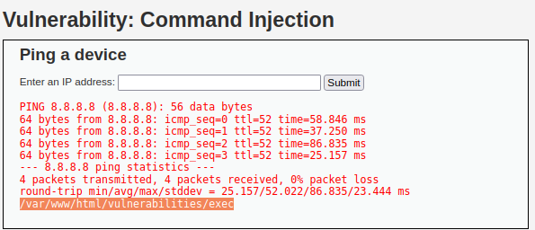
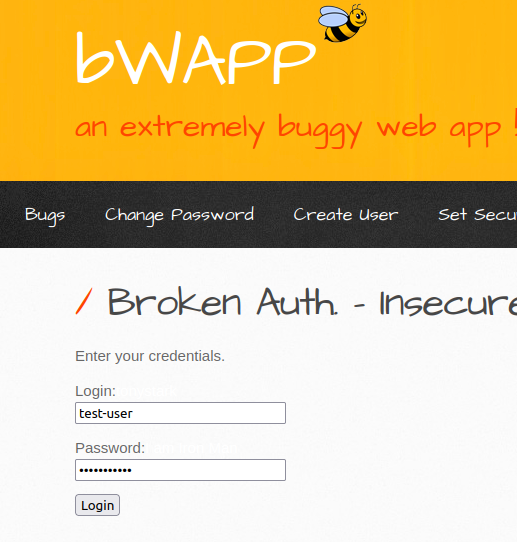
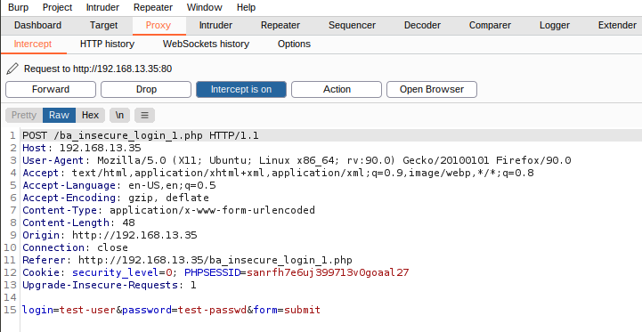
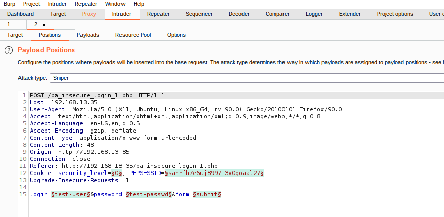

### Week 15: Web Vulnerabilities and Hardening Homework

---


#### Web Application 1: *Your Wish is My Command Injection*

**Launch the environment**

1. Launch Vagrant from GitBash or the Mac terminal using the following command: `vagrant up`

2. In VM run: `cd ./Documents/web-vulns && docker-compose up`

3. In VM`s web browser go to <http://192.168.13.25/setup.php>.

   [Reset Database Image](./Images/reset-data.png)

   - On the bottom of this page, click **Create / Reset Database**.
   - This will configure the database for the application.
   - The message "Setup Successful" at the bottom of the page will indicate that it is complete. 

4. Log in with the following credentials:

   [Login Screen Image](./Images/login.png)

   - Username: `admin`
   - Password: `password`

5. Navigate to the following **Command Injection** option.
   [Vulnerability: Command Injection Image](./Images/command-injection.png)

   - Test the webpage by entering the IP address `8.8.8.8`. Press Submit to see the results display on the web application.
     [Vulnerability: Command Injection 8.8.8.8 Image](./Images/8888.png)

     ````
     PING 8.8.8.8 (8.8.8.8): 56 data bytes
     64 bytes from 8.8.8.8: icmp_seq=0 ttl=52 time=133.469 ms
     64 bytes from 8.8.8.8: icmp_seq=1 ttl=52 time=39.395 ms
     64 bytes from 8.8.8.8: icmp_seq=2 ttl=52 time=37.529 ms
     64 bytes from 8.8.8.8: icmp_seq=3 ttl=52 time=64.746 ms
     --- 8.8.8.8 ping statistics ---
     4 packets transmitted, 4 packets received, 0% packet loss
     round-trip min/avg/max/stddev = 37.529/68.785/133.469/38.862 ms
     ````

     Behind the scenes, when you select Submit, the IP you type in the field is *injected* into a command that is run against the Replicants webserver. The specific command that ran on the webserver is `ping <IP>` and `8.8.8.8` is the field value that is injected into that command.

     

6. Now we test if we can manipulate the input to cause an unintended result. To do so we run the same command as before, the only difference is that we add  two ampersands and `pwd`.
   - Type `8.8.8.8 && pwd` in search field.
   
     
      This type of injection attack is called **Command Injection**, and it is dependent on the web application taking user input to run a command against an operating system.
   
   - This command shows us that we are in `/var/www/html/vulnerabilities/exec`.


7. Now that we have determined that Replicants new application is vulnerable to command injection, we are tasked with using the dot-dot-slash method to design two payloads that will display the contents of the following files:

   - `/etc/passwd`	

   - `/etc/hosts`     

     

---

**Solution** Input `8.8.8.8 && cat ../../../../../etc/hosts` to display the contents of the hosts file.

-  [Solution (/etc/hosts)](./Images/hosts.png)

Input `8.8.8.8 && cat ../../../../../etc/passwd` to display the contents of the  passwd file.

- [Solution (/etc/passwd)](./Images/passwd.png)


**Mitigation**

Applications should run using the lowest privileges that are required to accomplish the necessary tasks. If possible, create isolated accounts with limited privileges that are only used for a single task. Avoid calling OS commands directly. Built-in library functions are a very good alternative to OS Commands, as they cannot be manipulated to  perform tasks other than those it is intended to do. Make sure you stay up-to-date with patches and updates. Additionally, you can use a web application firewall (WAF), which can  block suspicious traffic that may include attempted command injection. One of the simplest and most effective ways to prevent command  injections is to scan your application with a dynamic application  security testing (DAST) tool like Neuralegion’s Nexploit. 

---


### Web Application 2: *A Brute Force to Be Reckoned With*

1. Setting up the activity.

   - Open a browser on Vagrant and navigate to the webpage <http://192.168.13.35/install.php>.

   - The page should look like the following: [Installation bWAPP Image](Images/install.png)

   - Click "here" to install bWapp. (See the arrow in the previous screenshot.) 

   - After successfully installing bWapp, use the following credentials to login.

     - Login: `bee`

     - Password: `bug`

       [Login bWAAP Image](Images/login2.png)

       - Navigate to http://192.168.13.35/ba_insecure_login_1.php *


(*) This page is an administrative web application that serves as a simple login page. An administrator enters their username and password and selects Login.

​			If the user/password combination is correct, it will return a successful message.

​			If the user/password combination is incorrect, it will return the message, "Invalid credentials."


2. Years ago, Replicants had a systems breach and several administrators passwords were stolen by a malicious hacker. The malicious hacker was only able to capture a list of passwords, not the associated accounts' usernames. Your manager is concerned that one of the administrators that accesses this new web application is using one of these compromised passwords. Therefore, there is a risk that the malicious hacker can use these passwords to access an administrator's account and view confidential data.

   - Use the web application tool **Burp Suite**, specifically the **Burp Suite Intruder** feature, to determine if any of the administrator accounts are vulnerable to a brute force attack on this web application. 

   - We've been provided with a list of administrators and the breached passwords:

     - [List of Administrators](Recourses/listofadmins.txt)

     - [Breached list of Passwords](Recourses/breached_passwords.txt)


### Brute Force Attack

**Setup the security proxy tool Burp Suite** [Link to Document](Setup-Burp-Suite-and-FoxyProxy.md)

1. With Burp Suite and FoxyProxy installed and ready to go our first step is to intercept the HTTP request. To do so we are entering a username and password that will purposely fail.
   - In the username field, enter "test-user".
   - In the password field, enter "test-passwd".




2. Return to Burp Intercept to see the HTTP Request.




3. Move the HTTP request to Burp Intruder.

   In this step we are moving the HTTP request to Burp Intruder.

   - Right-click on the Intercept page and select **Send to Intruder** (or press CTRL+I).

   - Select the Positions tab on the tool bar.   

     

     

4. Configure the Burp Intruder positions.

   - This page (Burp Intruder) is where we indicate the payloads  that we will change with each HTTP request.

   - Because we will be testing two payloads, the username and password, select the Cluster Bomb attack type. (**section sign** characters (`§`))

   - Clear out all of the section sign characters by clicking on **Clear §** on the right side of the page.

   - Create the first new payload by highlighting the value `test-user` and then clicking on **Add §**.

   - Create the second new payload by highlighting the value `test-passwd` and then clicking on **Add §**.

   - Your Positions page should now look similar to the following:

     ````
     POST /ba_insecure_login_1.php HTTP/1.1
     Host: 192.168.13.35
     User-Agent: Mozilla/5.0 (X11; Ubuntu; Linux x86_64; rv:90.0) Gecko/20100101 Firefox/90.0
     Accept: text/html,application/xhtml+xml,application/xml;q=0.9,image/webp,*/*;q=0.8
     Accept-Language: en-US,en;q=0.5
     Accept-Encoding: gzip, deflate
     Content-Type: application/x-www-form-urlencoded
     Content-Length: 48
     Origin: http://192.168.13.35
     Connection: close
     Referer: http://192.168.13.35/ba_insecure_login_1.php
     Cookie: security_level=0; PHPSESSID=sanrfh7e6uj399713v0goaal27
     Upgrade-Insecure-Requests: 1
     
     login=§test-user§&password=§test-passwd§&form=submit
     ````

     

5.  Configure the Burp Intruder payloads.

   - Select the Payloads tab. 

   - `§test-user§` is considered the Payload Set 1, as it comes first (starting from the top left).

   - `§test-passwd§` is considered the Payload Set 2, as it comes second (again, starting from the top left).

   - Under **Payload set**, select 1 from the drop-down.

   - Under **Payload type**, select **simple list**.

     - Under Payload Options [Simple list] we will add the names of the admins we've been provided by Replicants to test the brute force attack. 

       [Payload Options Admins Image](Images/admins.png)

       [Admin List](Recourses/listofadmins.txt)

     

   - Under **Payload set**, select 2 from the drop-down.

   - Under **Payload type**, select **simple list**.

     - Under Payload Options [Simple list] we will add the breached passwords we've been provided by Replicants to test the brute force attack. 

       [Payload Options Breached Passwords Image](Images/breach.png)
       [Breached Passwords List](Recourses/breached_passwords.txt)


6. Launching the brute force attack and analyzing the results.

   - To launch the brute force attack, select **Start attack** on the right side of the page.

     

---

**Solution / Results**

The Intruder Attack processed 100 requests and only one was successful as indicated in the [Intruder Attack Image](Images/bruteforce.png). (I sorted the results by `Length` to determine what attack was successful.)

``Login: tonystark``

``Password: I am Iron Man``

Back at the web browser navigate to http://192.168.13.35/ba_insecure_login_1.php and disable FoxyProxy, confirm the credentials for `tonystark` [Successful login! You really are Iron Man :)](Images/loginsuccess.png)


**Mitigation**

To prevent brute force attacks I would recommend implementing Account Lockouts. **Account lockouts with progressive delays** lock an account only for a set amount of time after a designated number of unsuccessful login attempts. **Making the Root User Inaccessible via SSH** would be another option since SSH brute force attempts are often carried out on the root user of a server. **Modifying the Default Port** could prove to be a useful way of dealing with brute force attacks, because most automated SSH attacks are attempted on the default port 22. **Two-factor authentication** is a great way of protection, even if an attacker cracks the password they would have to have access to your smartphone or email client to be successful. **Limit Logins to a Specified IP Address or Range** and allow access only from a designated IP address or range. Lastly be sure to **analyze your log files diligently**, log files are essential for maintaining a system.

---


### Web Application 3: *Where's the BeEF?*


References: 

- https://www.neuralegion.com/blog/os-command-injection/
- https://cheatsheetseries.owasp.org/cheatsheets/OS_Command_Injection_Defense_Cheat_Sheet.html

