### Week 18 Homework Submission File: Lets go Splunking!

**Step 1: The Need for Speed**

1. Using the `eval` command, create a field called `ratio` that shows the ratio between the upload and download speeds.

   > EVAL Command: `source="server_speedtest.csv" | eval ratio='DOWNLOAD_MEGABITS'/'UPLOAD_MEGABITS'`

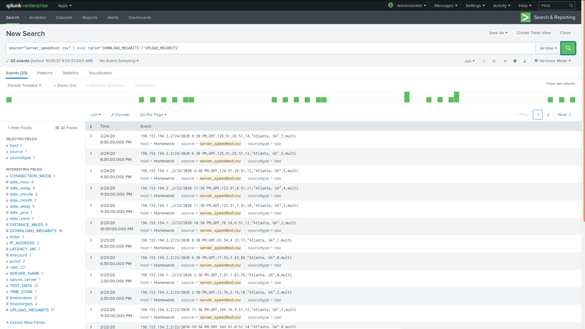

2. Create a report using the Splunk's `table` command to display the following fields in a statistics report:

   > Query: `source="server_speedtest.csv" | eval ratio='DOWNLOAD_MEGABITS'/'UPLOAD_MEGABITS' | sort -_time | table _time IP_ADDRESS DOWNLOAD_MEGABITS UPLOAD_MEGABITS ratio`

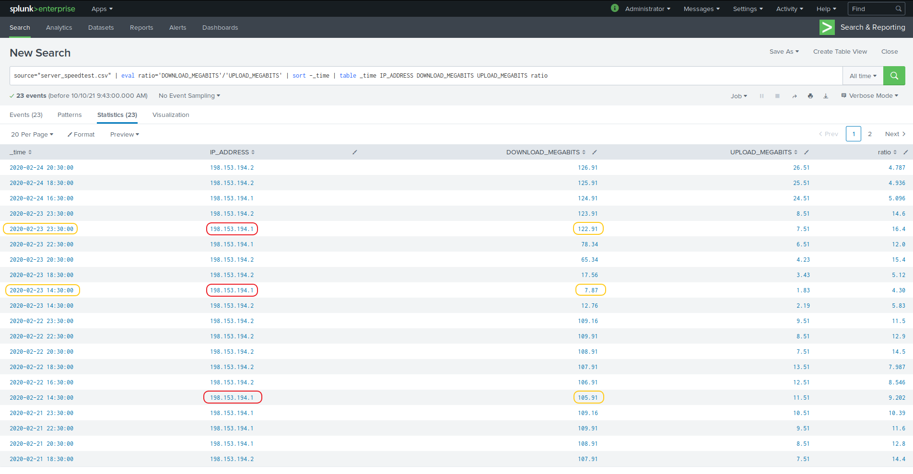

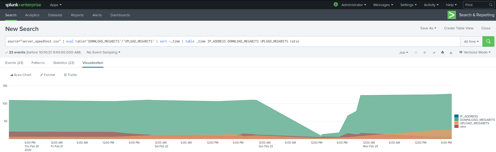

3. Answer the following questions:

   - Based on the report created, what is the approximate date and time of the attack?

     > The date of the attack was the  `02/23/2020` at `14:30`, where we see the download speed dropping dramatically down from `105.91Mbps` to `7.87 Mbps` and it lasted till `02/23/2020` at `23:30`, where the speed returned to normal over `122.91 Mbps`.

   - How long did it take your systems to recover?

     > It took the system 9 hours to recover.

---

**Step 2: Are We Vulnerable?**

1. Create a report that shows the `count` of critical vulnerabilities from the customer database server.
   - The database server IP is `10.11.36.23`.

   - The field that identifies the level of vulnerabilities is `severity`.

     > Query: `source="nessus_logs.csv" dest_ip="10.11.36.23" | eval CRITICAL=IF(severity="critical", "Critical", "Non-Critical") | stats count by CRITICAL`

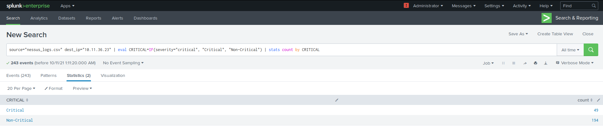

   > 49 Critical and 194 Non-Critical Vulnerabilities were  detected.

   

2. Build an alert that monitors every day to see if this server has any  critical vulnerabilities. If a vulnerability exists, have an alert  emailed to `soc@vandalay.com`.

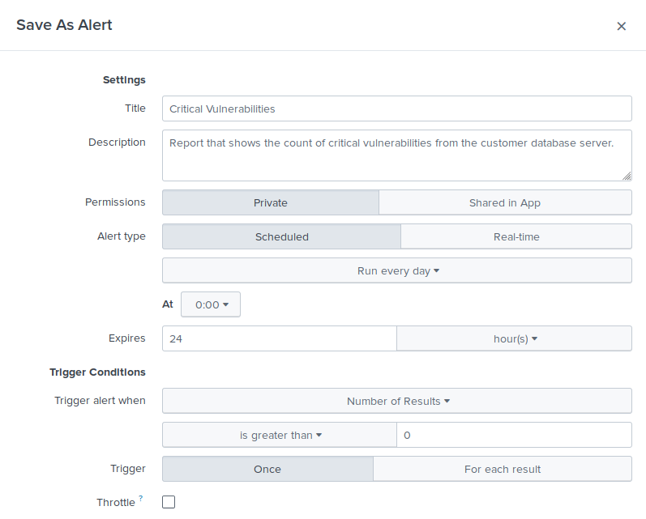
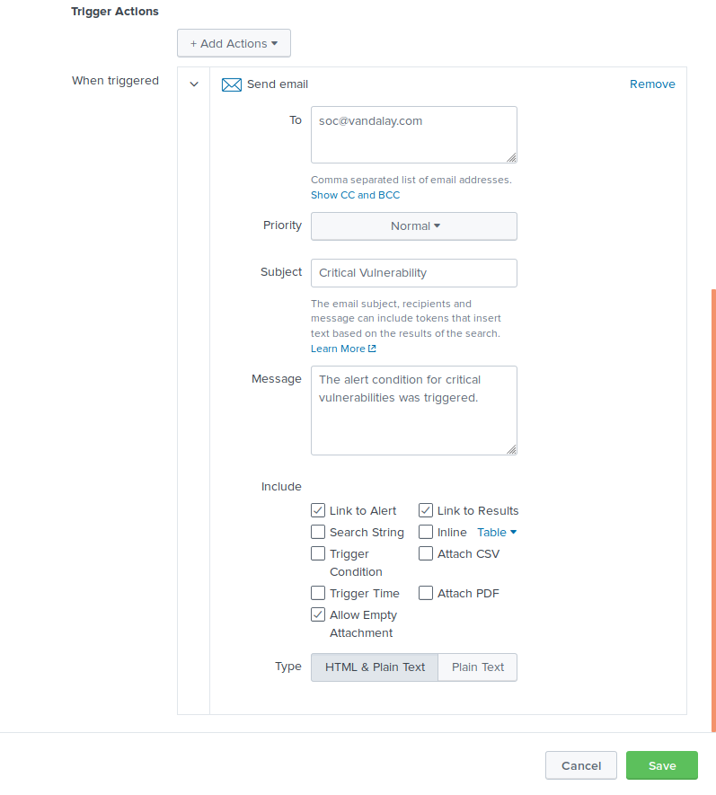
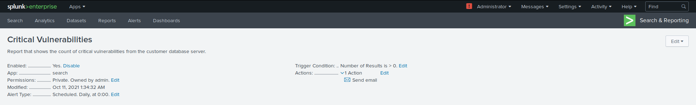
	
	
---

**Step 3: Drawing the (base)line**

1. When did the brute force attack occur?

   > The brute force attack occurred from `9:00 a.m. until 2:00 p.m. on 2/21/2020` for a total of `5 hours`.

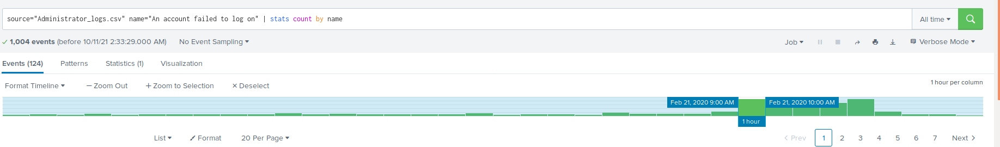
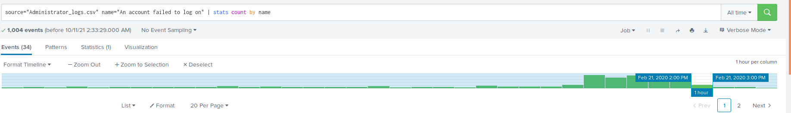

2. Determine a baseline of normal activity and a threshold that would alert if a brute force attack is occurring.

   > Normal activity ranged from 6 to 34 logins per hour. The threshold will be set at 40 logins per hour.

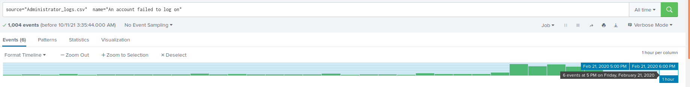
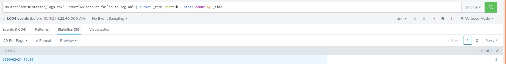
	
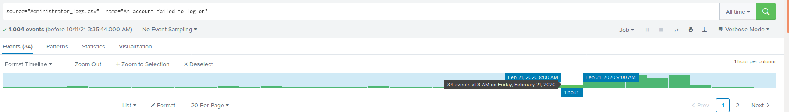
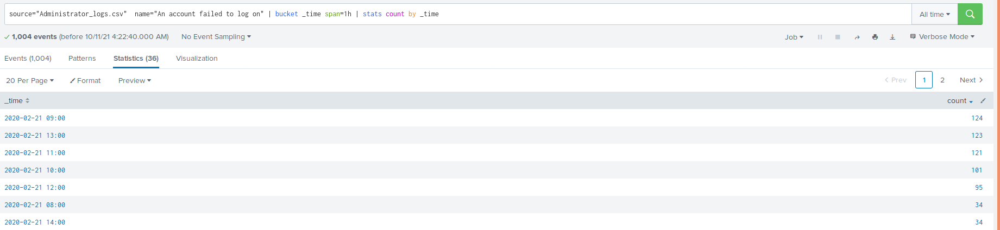

3. Design an alert to check the threshold every hour and email the SOC team at SOC@vandalay.com if triggered. 

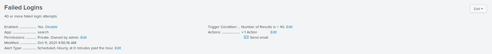

