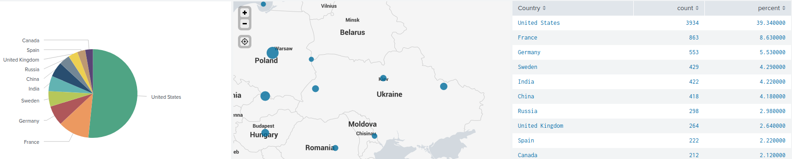
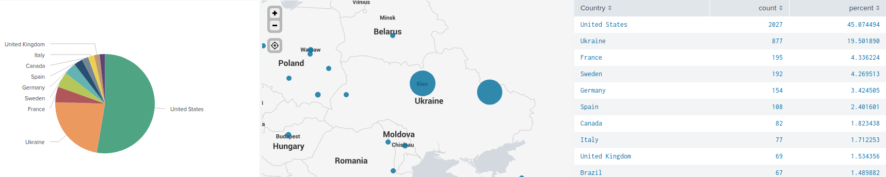
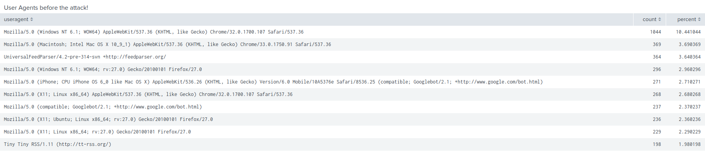
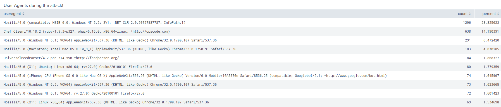
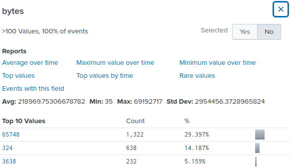

## Unit 19 Homework: Protecting VSI from Future Attacks

### Part 1: Windows Server Attack

Note: This is a public-facing windows server that VSI employees access.

#### Question 1

- Several users were impacted during the attack on March 25th.

- Based on the attack signatures, what mitigations would you recommend to protect each user account? Provide global mitigations that the whole company can use and individual mitigations that are specific to each user.

  - **Global Mitigation**

    - Implementing Multi-Factor-Authentication (MFA) which would require you to use an external device such as SMS-Code or a USB-Key.
    - Allow VPN logins only from compliant (Company approved) devices.
    - Utilizing  Single sign-on (SSO) authentication scheme, to allow a user to log in with a single ID and password to any of several related, yet independent, software systems.
    - Comply with the Company's BYOD Policies ( avoid logging in from non company devices, such as private laptop or private smartphone).
    - If there is no such Policy then I would strongly recommend to implement one.

    
  
  - **Individual Mitigations**
    - Mitigation for `User_k`  (An attempt was made to reset an account password) would be to set up user specific alerts with lower values which allows a closer monitoring (watch for the users password getting changed again)
    - Mitigation for `User_a`  (A user account was locked out) is to reset/change the users password immediately to a more unique/complex password.
    - Mitigation for `User_j`  (An account was successfully logged on) is to manually reset/change the user password to an password with the same requirements as of `User_a` and implement the mitigation method from `User_k` to be safer.
    - Every other User had either their accounts created or changed, no mitigation necessary. 

#### Question 2

- VSI has insider information that JobeCorp attempted to target users by sending "Bad Logins" to lock out every user.

- What sort of mitigation could you use to protect against this?

  - Mitigation 

    - Set up a group policy to automatically unlock users accounts after a specific amount of time.

    - Notify employees about an possible insider attack and urge for vigilance when handling important information.

    - Blacklisting currently known JobeCorp IP addresses.

    -  Whitelisting VIS employees IP addresses.

    - Create a human verification field after the first failed login attempt, this prevents scripted attacks.

----

### Part 2: Apache Webserver Attack:

#### Question 1

- Based on the geographic map, recommend a firewall rule that the networking team should implement.

  - Block all incoming HTTP traffic where the source IP comes from the country of Ukraine

    

- Provide a screen shot of the geographic map that justifies why you created this rule. 

  - Shows Ukraine's incoming HTTP traffic before the attack:

  - During the attack, there was a significant increase in traffic from Ukraine

#### Question 2

- VSI has insider information that JobeCorp will launch the same  webserver attack but use a different IP each time in order to avoid  being stopped by the rule you just created.
- What other rules can you create to protect VSI from attacks against your webserver?
  - Block all incoming HTTP traffic where the useragent  is Mozilla/4.0 (outdated web browser)
  - Block all incoming HTTP traffic where the useragent  is Chef Client/10.18.2
  - Block all incoming HTTP traffic where the bytes amount is 65748

Before:

During:

Bytes:

