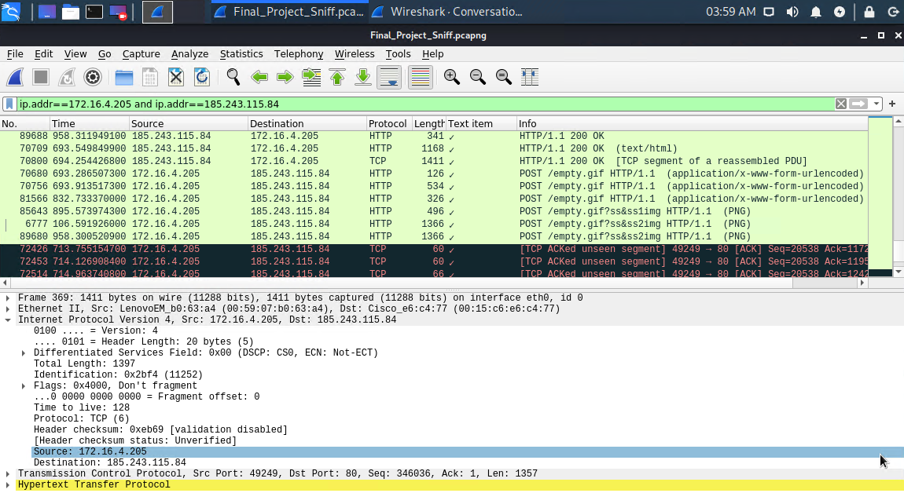

# Network Forensic Analysis Report

## Overview

You are working as a Security Engineer for X-CORP,  supporting the SOC infrastructure. The SOC analysts have noticed some  discrepancies with alerting in the Kibana system and the manager has  asked the Security Engineering team to investigate.

You will monitor live traffic on the wire to detect any  abnormalities that aren't reflected in the alerting system. You are to  report back all your findings to both the SOC manager and the  Engineering Manager with appropriate analysis.

The Security team requested this analysis because they  have evidence that people are misusing the network. Specifically,  they've received tips about:

- "Time thieves" spotted watching YouTube during work hours.
- At least one Windows host infected with a virus.
- Illegal downloads.

A number of machines from foreign subnets are sending  traffic to this network. Your task is to collect evidence confirming the Security team's intelligence.

## Time Thieves 

At least two users on the network have been wasting time on YouTube.  Usually, IT wouldn't pay much mind to this behavior, but it seems these  people have created their own web server on the corporate network. So  far, Security knows the following about these time thieves:

- They have set up an Active Directory network.
- They are constantly watching videos on YouTube.
- Their IP addresses are somewhere in the range 10.6.12.0/24.

You must inspect your traffic capture to answer the following questions:

1. **What is the domain name of the users' custom site?**
   - The domain name is **Frank-n-Ted-DC.frank-n-ted.com**.
   - Filter: `ip.addr==10.6.12.0/24`

Results Screenshot:

2. **What is the IP address of the Domain Controller (DC) of the AD network?**
   - IP address is **10.6.12.12** (Frank-n-Ted-DC.frank-n-ted.com)
   - Filter: `ip.addr==10.6.12.0/24`

Results Screenshot: 

   

3. **What is the name of the malware downloaded to the 10.6.12.203 machine?**

   - Malware file name: `june11.dll`
   - Filter: `ip.addr == 10.6.12.0/24 and http.request.method == GET`

Results Screenshot: 

4. **Upload the file to VirusTotal.com. What kind of malware is this classified as?** 

   - This type of malware is classified as a **Trojan**.

   VirusTotal Analysis Screenshot:

---

## Vulnerable Windows Machine

The Security team received reports of an infected Windows host on the network. They know the following:

- Machines in the network live in the range `172.16.4.0/24`.
- The domain mind-hammer.net is associated with the infected computer.
- The DC for this network lives at `172.16.4.4` and is named Mind-Hammer-DC.
- The network has standard gateway and broadcast addresses.

Inspect your traffic to answer the following questions in your network report:

1. **Find the following information about the infected Windows machine:**
    - Host name: **ROTTERDAM-PC**
    - IP address: **172.16.4.205**
    - MAC address: **00:59:07:b0:63:a4**
    - Filter: `ip.src==172.16.4.4 and kerberos.CNameString`

Results Screenshot:

2. **What is the username of the Windows user whose computer is infected?** 
   - The username is **matthijs.devries**.
   - Filter: `ip.src==172.16.4.205 and kerberos.CNameString`

Results Screenshot:

3. **What are the IP addresses used in the actual infection traffic?** 
   - Based on the Conversations statistics and then filtering by the highest amount packets between IPs , **172.16.4.205, 185.243.115.84, 166.62.11.64 are the infected traffic**.
   - Filter: `ip.addr==172.16.4.205 and ip.addr==185.243.115.84`

Results Screenshot:

**Referencing 185.243.115.84 (b569023.green.mattingsolutions.co) there is a large amount of POST methods of empty.gif being sent without any  originating GET request. This is suspicious and odd.**

4. **As a bonus, retrieve the desktop background of the Windows host.**

Results Screenshot:

---

## Illegal Downloads

IT was informed that some users are torrenting on the  network. The Security team does not forbid the use of torrents for  legitimate purposes, such as downloading operating systems. However,  they have a strict policy against copyright infringement.

IT shared the following about the torrent activity:

- The machines using torrents live in the range 10.0.0.0/24 and are clients of an AD domain.
- The DC of this domain lives at 10.0.0.2 and is named DogOfTheYear-DC.
- The DC is associated with the domain dogoftheyear.net.

Your task is to isolate torrent traffic and answer the following questions:

1. **Find the following information about the machine with IP address `10.0.0.201`:**
   
    - MAC address: **00:16:17:18:66:c8**
    - Windows username: **elmer.blanco**
    - Host Name (OS version): **BLANCO-DESKTOP**
    - Filter: `ip.src==10.0.0.201 and kerberos.CNameString`
    - Filter: `ip.addr == 10.0.0.201 && dhcp`
    - Filter: `ip.addr == 10.0.0.201 && http.request`
    

 **Results Screenshot for Username:**
    

 **Results Screenshot for MAC Address:**

**Results Screenshot for OS Type and Version:** `ip.addr == 10.0.0.201 && http.request`

2. Which torrent file did the user download?
   - Betty_Boop_Rhythm_on_the_Reservation.avi.torrent

Results Screenshot:

